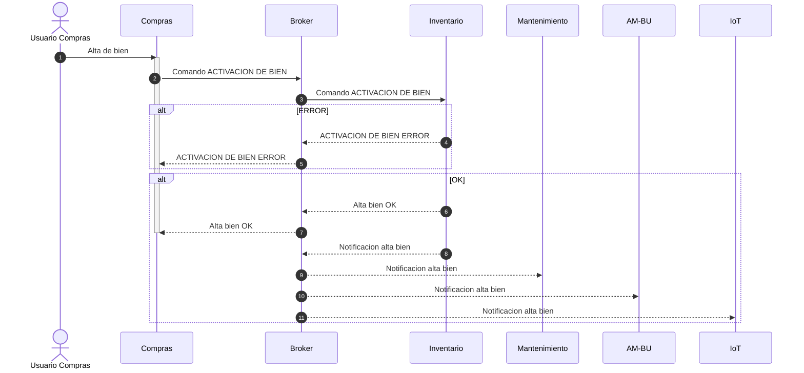
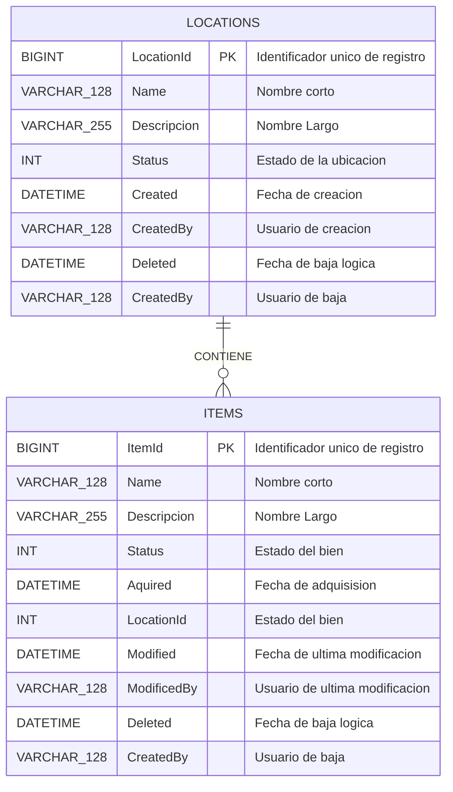
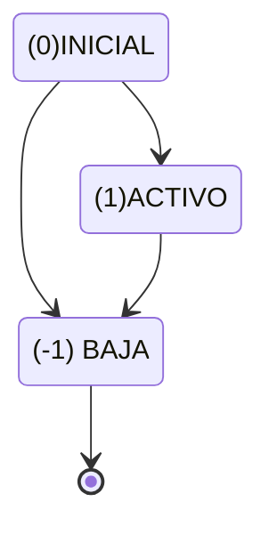

# INVENTARIO, MANTENIMIENTO Y CONTROL DE BIENES

## DESCRIPCION

### SITUACION ACTUAL

En la actualidad hay 4 flujos de trabajo, de los cuales IoT no se encuentra implementado. Se debe integrar las información compartida de estos 4 sistemas.

**COMPRAS**: La adquisición de bienes se puede dar mediante del sector de compras o por compra directa utilizando *“caja chica”* o distintos centros de costos de los institutos de la universidad. EL objetivo del sistema de compras es registrar el proceso de adquisición. Fecha de adquisición, valor de adquisición, sector de adquisición (el sector es organizacional no de ubicación física) esto es afines de saber quién es el *“dueño”* del bien.

**AMORTIZACION Y BIENES DE USO:** Cada bien que la universidad adquiere es considerado un bien de uso (escritorios, computadoras, automóviles). Todos los meses se realiza un proceso amortización que genera asientos contra el sistema contable representando el desgaste de estos bienes a la fecha. Con ese fin cada bien de uso debe tener una fecha de adquisición, vida útil en años (contable) y valor de adquisición en pesos. **A FINES PRACTICOS EL DETALLE CONTABLE DE LA AMORTIZACION ESTA SIMPLIFICADO**

**MANTENIMIENTO EDILICIO**: lleva un control de la ubicación física de los bienes, fecha de adquisición, marca, modelo, documentación (factura, manuales, etc.), proveedor, soporte, historial de mantenimiento, notas .

**IOT**: Hay dispositivos inteligentes conectados a la red de la universidad (Aires acondicionados inteligentes, sensores de temperatura, sensores de CO2, switchs de luz inteligentes, UPS inteligentes). Dichos dispositivos están integrados por un BROKER de mensajes MQTT capaz de enviar y recibir información.
Los datos enviados por estos dispositivos deben ser almacenados en una base de datos de serie de tiempo que contiene los siguientes datos: ID DE DISPOSITIVO, SENSORES, TIMESTAMP, VALOR.

Es importante poder restringir la visualización de los datos de los sensores/DISPOSITIVOS por su ubicación física.

### PROBLEMATICA

La registración de bienes esta descentralizada y no es posible llevar un rastreo de los bienes.

La amortización de bienes de uso se lleva a mano por Excel y se carga manualmente la contabilidad mediante una interface por archivos. Hay inconsistencias entre la contabilidad y los bienes de uso, no se sabe dónde están ubicados o si están en uso (por que se rompieron).

El mantenimiento se lleva con planillas físicas, los manuales no se resguardan. No se realiza el mantenimiento en tiempo y forma de distintos equipos. Por ejemplo, las UPS de la biofábrica no tienen un cambio de batería hace 4 años.

El sistema de IoT no existe, pero debe integrarse con el sistema de mantenimiento edilicio con el fin de utilizar los datos adquiridos para mantenimiento preventivo / predictivo (por ejemplo si un aire acondicionado consume más energía que el resto puede ser que le falte gas o tenga sucio los filtros).

## USUARIOS

Los sistemas tiene pocos usuarios, entre 10 y 15 usuarios por secotor. No hay usuarios comunes entre los sistemas, es decir que el usuario de compras no accede al de mantenimiento. 

## REQUERIMIENTOS

**Características** 

- Separación de los sub-dominios `CORE` (que es propio de cada característica), `GENERIC`(es independiente de la característica y puedo usar un producto existente) Y `SUPPORTING` (no es un elemento core pero es necesario).
- Minimizar el acoplamiento entre los distintos elementos sin perder sinergia/cohesión. 
- Cuando el usuario de compras cree un nuevo bien, el mismo debe estar disponible para el resto de los sistemas.
- Cuando el usuario de mantenimiento indique que un bien ha sido descartado, el sistema de amortización debe reflejar la perdida contable e informar al al sistema de IoT, si aplica, para que no muestre un alerta de desconexión.
- de mantenimiento indique que un bien ha sido reubicado, el sistema de  IoT debe representar su nueva ubicación.

**TAREAS**
Teniendo en cuenta las características requeridas

- Defina la estructura de la arquitectura. 
- Defina las decisiones de arquitectura. 
- Realice un diagrama de contenedores, según el modelo C4,  
- Defina casos de uso y su secuencia
- Defina los contratos relevantes
- Si emplea algún supuesto debe aclararlo.

# RESOLUCIÓN

## SUBDOMINIOS CORE

- COMPRAS

- AM-BU

- MANTENIMIENTO

- CATALOGO-IOT

## SUBDOMINIOS SUPPORTING

- INVENTARIO DE BIENES

## SUBDOMINIOS GENERIC

- BASE DE DATOS SQL

- BASE DE DATOS NOSQL

- MQTT BROKER

- GRAFANA

- TSDB FORWARDER

- RABBITMQ

- TODO: KEYCLOAK / OIDC IDENTITY PROVIDER

## DECISIONES DE ARQUITECTURA

ARQUTIECTURA DE CADA SISTEMA: LAYERED, Como cada sistema tiene pocos usuarios es mejor mantener una estructura simple a fin de no aumentar tiempo de desarrollo e implementacion.

INTEGRACION DE SISTEMAS: Se utiliza el `MEDIATOR PATTERN` para la integración del inventario. Con los siguientes mensajes. Es clave mantener el "contrato" o la "interface" del servicio de inventario inmutable o poco volátil. Si bien este elemento suma complejidad al sistema es necesario para poder desacoplar los otros sistemas y que evolucionen en forma independiente.

1. COMANDO DE ALTA/ACTIVACION DE BIEN
2. COMANDO DE BAJA (LOGICA) DE BIEN
3. COMANDO DE CONSULTA DE BIENES / BIEN
4. COMANDO DE MODIFICACION UBICACION DEL BIEN
5. COMANDO DE MODIFICACION NOMBRE Y DESCRIPCION DEL BIEN
6. NOTIFICACION DE NUEVO BIEN
7. NOTIFICACION DE BIEN MODIFICADO
8. NOTIFICACION DE BAJA DE BIEN

### ACTIVACION DE BIEN

Los biene dados de alta en el sistema de compras deben ser activados. Esto cambia el estado del bien e informa al resto de los sistemas qeu hay un nuevo bien disponible

### INTERFACE SISTEMA DE INVENTARIO

Si bien no es una base de datos relacional, creo que un DER es útil para la representación de datos

- A fin de reducir el acoplamiento del sistema de IOT con el sistema de mantenimiento se agrega las ubicaciones al catalogo

- Propiedades modificables de un bien
  
  - Items.Name
  
  - Items.Description
  
  - Items.Status

#### ITEMS.Status

#### LOCATIONS.Status

## SUPUESTOS

- El acceso a la información de dispositivos en Grafana se maneja con autorización a nivel de dashboard.
- El comun denominador de un bien en los distintitos sistemas es el IDENTIFICADOR UNICO DE BIEN. Asignado al momento del alta del BIEN
- Los estados producen un acoplamiento de "SIGNIFICADO" esto es aceptable en campos de estado y se debe evitar alterarlos y mantenerlos lo mas simple posible

## POSIBILIDADES DE MEJORA

- INCORPORAR OIDC
- ALMACENAR LOS MANUALES DE MANTENIMIENTO EN ALGO COMO MINIO EN VEZ DE LA BASE DE DATOS.
- MAPA DE LOS MENSAJES
- DIAGRAMA DE SECUENCIA DEL COMANDO DE ALTA O BAJA DE BIEN
- LOCATIONS DEBERIA SER UNA ESTRUCTURA DE ARBOL, VER EL PATRON MATERIALIZED_TREE EN MONGODB
